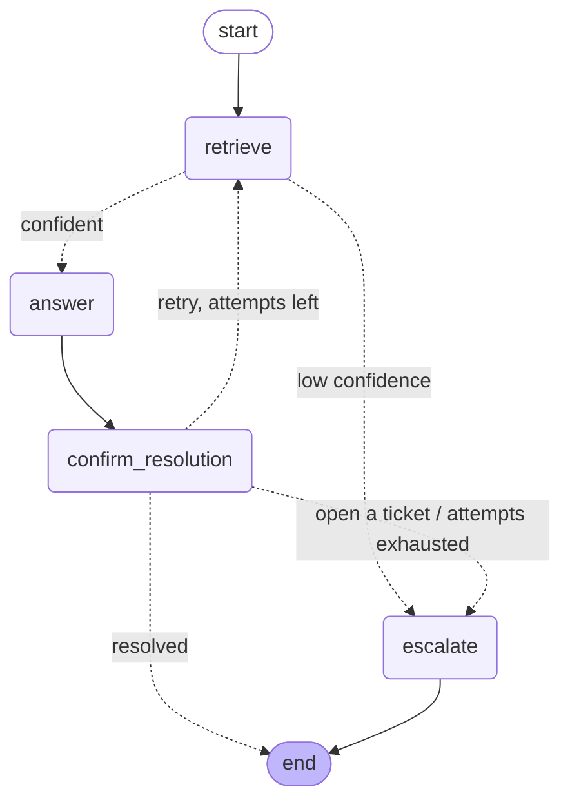

# AWS MLOps Support Agent

**An agentic RAG assistant that answers AWS CI/CD questions from the official AWS docs — and files a Jira ticket for a human when it can't.**


---

## What it does & why

Ask it a question like *"How do I cache dependencies between CodeBuild builds?"* and it searches the
official AWS CodeBuild and CodePipeline documentation, writes a grounded answer **with citations**, and
asks whether that resolved your issue. If it didn't — or if the docs clearly don't cover your question —
the agent drafts a **Jira support ticket** (summarizing the problem, which docs it already checked, and
suggested next steps) and hands it off to a developer team.

It's a portfolio project built to practice **RAG**, **agentic workflows (LangGraph state machines)**, and
**MLOps on AWS** end to end — from document ingestion to a deployed, observable service.

**Key features**

- 🔎 **Grounded answers with citations** — every answer links back to the exact AWS doc section it used.
- 🧠 **Agentic escalation** — a LangGraph state machine loops, retries, and escalates when confidence is low, retries run out, or you ask it to.
- 🎫 **Jira ticket drafting** — turns an unresolved question into a structured ticket (safe: dry-run by default, so no ticket is created unless you explicitly opt in).
- 🙋 **Human-in-the-loop** — the agent pauses mid-run to ask *"did this resolve it, or should I open a ticket?"*
- 📊 **Built-in evals & tracing** — retrieval-quality eval set, LangSmith tracing, and CloudWatch-friendly JSON logging.
- 🚀 **Real deployment path** — containerized, pushed to ECR via GitHub Actions, running on ECS Fargate with secrets in AWS Secrets Manager.

> **Live demo note:** the hosted demo forces Jira into **dry-run mode**, so visitors can't create real tickets — the drafted payload is logged instead.

---

## Architecture at a glance

The core is a small **state machine**: retrieve → answer → confirm → (maybe) escalate. Solid arrows are
always-taken; dashed arrows are **conditional** (a decision function picks the next step).



| Step | What happens |
|------|--------------|
| **retrieve** | Embed the question (OpenAI) and pull the top-k matching doc chunks from Pinecone. |
| **answer** | The chat model writes an answer grounded *only* in those chunks, with `[n]` citations. |
| **confirm_resolution** | The graph **pauses** and asks the user: resolved, retry, or open a ticket? |
| **escalate** | Builds a Jira ticket draft (problem + docs checked + next steps); files it only if not in dry-run. |

**Escalation fires on any of three triggers:** low retrieval confidence, the user asking for a ticket, or
retries being exhausted — each decided in exactly one routing function ([`src/agent/graph.py`](src/agent/graph.py)).

**Tech stack:** Python 3.13 · [LangGraph](https://langchain-ai.github.io/langgraph/) (orchestration) ·
[LangChain](https://python.langchain.com/) (RAG plumbing) · [Pinecone](https://www.pinecone.io/) serverless
(vector DB) · OpenAI via `langchain_openai` (chat + embeddings) · Jira Cloud REST API · Docker · ECS Fargate ·
GitHub Actions + ECR · CloudWatch + [LangSmith](https://smith.langchain.com/) (logging & tracing).

---

## Quick start

**Prerequisites:** Python 3.13, [`uv`](https://docs.astral.sh/uv/), an **OpenAI API key**, and a
**Pinecone API key** (free serverless tier is enough). Jira and LangSmith are optional.

```bash
git clone https://github.com/Rownak/aws-mlops-support-agent.git
cd aws-mlops-support-agent

cp .env.example .env        # then fill in OPENAI_API_KEY and PINECONE_API_KEY
uv sync                     # install dependencies from the lockfile

uv run python -m src.ingest # fetch AWS docs, chunk, embed, upsert to Pinecone (one-time)

uv run streamlit run src/demo/streamlit_app.py   # open the chat demo
```

That's the whole path: within a few minutes you have a running chat UI backed by a real vector index.
The `src.ingest` step pulls the AWS docs at build time (they're never committed — see
[License & attribution](#license--attribution)) and is safe to re-run (idempotent upserts).

Prefer the terminal? Skip Streamlit and run the CLI agent instead:

```bash
uv run python -m src.app
```

---

## Configuration

Configuration comes entirely from environment variables (loaded from `.env` locally; from AWS Secrets
Manager in production). Copy [`.env.example`](.env.example) to `.env` and fill in the two required keys —
everything else has a sensible default.

| Variable | Required? | Default | Description |
|----------|-----------|---------|-------------|
| `OPENAI_API_KEY` | ✅ | — | OpenAI key for chat + embeddings. |
| `PINECONE_API_KEY` | ✅ | — | Pinecone key for the vector index. |
| `OPENAI_CHAT_MODEL` | | `gpt-4o-mini` | Chat model for answer generation. |
| `OPENAI_EMBEDDING_MODEL` | | `text-embedding-3-small` | Embedding model — **must match** between ingest and query. |
| `PINECONE_INDEX_NAME` | | `aws-mlops-docs` | Serverless index name (auto-created on ingest). |
| `AWS_REGION` | | `us-east-1` | AWS region. |
| `DRY_RUN` | | `true` | Safety gate: Jira tickets are only *logged* unless explicitly set to `false`. |

<details>
<summary>Optional: Jira ticket creation & LangSmith tracing</summary>

| Variable | Required? | Description |
|----------|-----------|-------------|
| `JIRA_BASE_URL` | Only to create real tickets | e.g. `https://your-site.atlassian.net`. |
| `JIRA_EMAIL` | Only to create real tickets | The email you log into Jira with. |
| `JIRA_API_TOKEN` | Only to create real tickets | API token (not your password) — [create one here](https://id.atlassian.com/manage-profile/security/api-tokens). |
| `JIRA_PROJECT_KEY` | Only to create real tickets | Project key to file under, e.g. `SUP`. |
| `LANGSMITH_TRACING` | Optional | Set to `true` to trace every graph run. |
| `LANGSMITH_API_KEY` | Optional | LangSmith key ([free account](https://smith.langchain.com)). |
| `LANGSMITH_PROJECT` | Optional | Trace bucket name (defaults to `default`). |

`.env.example` has step-by-step setup notes for each of these. Never commit real secrets — `.env` is gitignored.
</details>

---

## Usage

**Chat demo (Streamlit)** — the recommended way to see the full flow, including the mid-conversation
"resolved / open a ticket?" prompt:

```bash
uv run streamlit run src/demo/streamlit_app.py
```

**CLI agent** — same graph, in the terminal:

```bash
uv run python -m src.app
```

**Peek at retrieval quality** — run a one-off query and print the top chunks + metadata:

```bash
uv run python -m src.ingest.sanity_check "How do I add a manual approval to a pipeline?" -k 3
```

**Answer a single question (no state machine)** — the bare RAG core:

```bash
uv run python -m src.rag.ask "What phases can I define in a buildspec file?" -k 4
```

---

## Project structure

```text
src/
├── config.py            # env-var loading + validation (fails clearly if a required key is missing)
├── observability.py     # CloudWatch-friendly JSON-lines logging
├── app.py               # CLI entrypoint for the agent
├── ingest/              # RAG corpus pipeline: fetch AWS docs → chunk → embed → upsert to Pinecone
├── rag/                 # framework-free RAG core: retriever, answer generation, confidence heuristic
├── agent/               # LangGraph state machine: state, nodes, graph wiring, Jira tool, ticket builder
├── demo/                # Streamlit chat UI (Jira forced to dry-run)
└── evals/               # retrieval + escalation eval set, runner, and saved results table
tests/                   # 60+ offline tests (no network — fakes injected for retriever/LLM/Jira)
deploy/                  # ECR + ECS Fargate setup runbooks and task definition
```

Design notes and placement rules live in [`claude/docs/architecture.md`](claude/docs/architecture.md).

---

## Evaluation results

A 15-question eval set (12 in-corpus with expected doc files, 3 off-corpus negatives) measures whether
retrieval surfaces the right docs (**hit@4**) and whether the agent escalates when it should. Runner:
`uv run python -m src.evals` (embedding calls only, no LLM). Full table:
[`src/evals/results.md`](src/evals/results.md).

| Metric | Result | Notes |
|--------|--------|-------|
| **Hit@4** (in-corpus) | **11 / 12** | Correct doc in the top 4 chunks for all but one question. |
| **Escalation accuracy** | **12 / 15** | All 3 misses are off-corpus questions the retriever scored too confidently. |

**Honest caveat:** the 3 escalation failures are off-corpus questions (EKS, SageMaker, account
password) that scored *above* the `0.35` confidence threshold — the current heuristic (top cosine
score) doesn't cleanly separate "irrelevant but adjacent" AWS topics. Tuning that threshold / adding a
reranker is a deliberate next step, not a solved problem. Being upfront about this is part of the point.

---

## Testing

```bash
uv run pytest            # 60+ tests, fully offline (fakes injected for retriever, LLM, and Jira)
uv run ruff check .      # lint
uv run ruff format .     # format
```

Tests favor small, injectable fakes over mocking the network — the graph accepts stub
retriever/answerer/Jira functions, so the full interrupt-and-resume flow is tested with no API keys.

---

## Deployment

The agent ships as a container and runs on **ECS Fargate**, with images built and pushed to **ECR** by
**GitHub Actions** (OIDC — no AWS keys stored in GitHub). Secrets come from **AWS Secrets Manager**.

```bash
docker build -t aws-mlops-support-agent .          # multi-stage build, non-root, serves Streamlit on 8501
docker run --env-file .env -p 8501:8501 aws-mlops-support-agent
```

Full, step-by-step AWS runbooks:

- [`deploy/aws_ecr_setup.md`](deploy/aws_ecr_setup.md) — one-time ECR + GitHub OIDC setup.
- [`deploy/aws_ecs_setup.md`](deploy/aws_ecs_setup.md) — Secrets Manager, task definition, service, verification, and cost control (scale-to-zero).

Ingestion runs **separately** from serving (locally or as a scheduled job) — the container only serves;
the corpus already lives in Pinecone.

---

## Roadmap / status

**Status:** feature-complete portfolio demo (Phases 0–6 done) — happy path works end to end and is deployed.

Backlog / next steps:

- Tune the confidence threshold / add a reranker to fix off-corpus escalation (see caveat above).
- Expand the corpus (Step Functions, Lambda, EventBridge, S3, CloudFormation, IAM).
- Swap Pinecone → OpenSearch Serverless / pgvector for an all-AWS stack.
- Schedule ingestion via EventBridge; response streaming in the UI.

---

## FAQ / troubleshooting

<details>
<summary>Ingestion fails or the index looks empty</summary>

`src.ingest` clones the AWS doc repos with full history and checks out the commit *before* they were
archived (the content was later stripped from the default branch). If it can't find `doc_source/*.md`,
make sure `git` is on your PATH and the clone completed. Re-running is safe — upserts are idempotent.
</details>

<details>
<summary>The demo answers but never offers a ticket</summary>

That's expected when retrieval is confident and you mark the issue resolved. To see escalation, ask an
off-topic question (low confidence), or choose "open a ticket" at the confirm prompt. In the demo,
tickets are always dry-run (logged, not created).
</details>

<details>
<summary>`docker --env-file` rejects my `.env`</summary>

Docker is stricter than python-dotenv about whitespace in variable *names* (e.g. `LANGSMITH_TRACING =`
with a space before `=`). Remove stray spaces around `=` in `.env`.
</details>

<details>
<summary>Answers seem outdated</summary>

The AWS docs corpus is frozen at roughly 2023 (the last content before the source repos were archived).
Fine for a demo; not a substitute for current AWS documentation.
</details>

---

## License & attribution

- **Code:** [MIT](LICENSE) — free to use, modify, and learn from.
- **AWS documentation content:** the ingested docs (AWS CodeBuild & CodePipeline user guides) are
  © Amazon Web Services, licensed under **[CC BY-SA 4.0](https://creativecommons.org/licenses/by-sa/4.0/)**.
  This repository **does not redistribute** the raw doc text — it is fetched at build time by
  `src.ingest` from the public `awsdocs` GitHub repositories (https://github.com/awsdocs). Attribution: *"AWS Documentation,"
  © Amazon Web Services, Inc., used under CC BY-SA 4.0.*

Built as a learning project — RAG, agentic AI, and MLOps on AWS.
