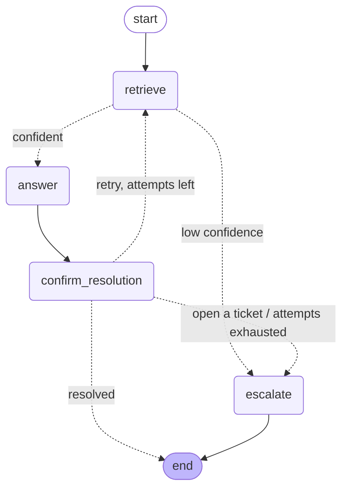

# AWS MLOps Support Agent

**An agentic RAG assistant that answers AWS CI/CD questions from the official AWS docs — and files a Jira ticket for a human when it can't.**


---

## What it does & why

Ask it a question like *"How do I cache dependencies between CodeBuild builds?"* and it searches the
official AWS CodeBuild and CodePipeline documentation, writes a grounded answer **with citations**, and
asks whether that resolved your issue. If it didn't — or if the docs clearly don't cover your question —
the agent drafts a **Jira support ticket** (summarizing the problem, which docs it already checked, and
suggested next steps) and hands it off to a developer team.

It's a portfolio project showcasing end-to-end implementation of **RAG**, **agentic workflows (LangGraph state machines)**, and
**MLOps on AWS** covering document ingestion to a deployed, observable service.

**Key features**

- 🔎 **Grounded answers with citations** — every answer links back to the exact AWS doc section it used.
- 🧠 **Agentic escalation** — a LangGraph state machine loops, retries, and escalates when confidence is low, retries run out, or you ask it to.
- 🎫 **Jira ticket drafting** — turns an unresolved question into a structured ticket (safe: dry-run by default, so no ticket is created unless you explicitly opt in).
- 🙋 **Human-in-the-loop** — the agent pauses mid-run to ask *"did this resolve it, or should I open a ticket?"*
- 📊 **Built-in evals & tracing** — retrieval-quality eval set, LangSmith tracing, and CloudWatch-friendly JSON logging.
- 🧩 **Reusable engine** — the RAG half is a separate, independently installable package (`rag-core`); this AWS agent is just its first consumer.
- 🚀 **Real deployment path** — containerized, pushed to ECR via GitHub Actions, running on ECS Fargate with secrets in AWS Secrets Manager.

> **Live demo note:** the hosted demo forces Jira into **dry-run mode**, so visitors can't create real tickets — the drafted payload is logged instead.

---

## Architecture at a glance

The core is a small **state machine**: retrieve → answer → confirm → (maybe) escalate. Solid arrows are
always-taken; dashed arrows are **conditional** (a decision function picks the next step).


```mermaid
graph TD;
    __start__([start]):::first
    retrieve(retrieve)
    answer(answer)
    confirm_resolution(confirm_resolution)
    escalate(escalate)
    __end__([end]):::last
    __start__ --> retrieve;
    retrieve -.->|confident| answer;
    retrieve -.->|low confidence| escalate;
    answer --> confirm_resolution;
    confirm_resolution -.->|resolved| __end__;
    confirm_resolution -.->|retry, attempts left| retrieve;
    confirm_resolution -.->|open a ticket / attempts exhausted| escalate;
    escalate --> __end__;
    classDef default fill:#f2f0ff,line-height:1.2
    classDef first fill-opacity:0
    classDef last fill:#bfb6fc
```

| Step | What happens |
|------|--------------|
| **retrieve** | Embed the question (OpenAI) and pull the top-k matching doc chunks from Pinecone. |
| **answer** | The chat model writes an answer grounded *only* in those chunks, with `[n]` citations. |
| **confirm_resolution** | The graph **pauses** and asks the user: resolved, retry, or open a ticket? |
| **escalate** | Builds a Jira ticket draft (problem + docs checked + next steps); files it only if not in dry-run. |

**Escalation fires on any of three triggers:** low retrieval confidence, the user asking for a ticket, or
retries being exhausted — each decided in exactly one routing function
([`agent/graph.py`](packages/aws_mlops_support_agent/src/aws_mlops_support_agent/agent/graph.py)).

**Tech stack:** Python 3.13 · [LangGraph](https://langchain-ai.github.io/langgraph/) (orchestration) ·
[LangChain](https://python.langchain.com/) (RAG plumbing) · [Pinecone](https://www.pinecone.io/) serverless
(vector DB) · OpenAI via `langchain_openai` (chat + embeddings) · Jira Cloud REST API · Docker · ECS Fargate ·
GitHub Actions + ECR · CloudWatch + [LangSmith](https://smith.langchain.com/) (logging & tracing).

---

## Quick start

**Prerequisites:** Python 3.13, [`uv`](https://docs.astral.sh/uv/), an **OpenAI API key**, and a
**Pinecone API key** (free serverless tier is enough). Jira and LangSmith are optional.

```bash
git clone https://github.com/Rownak/aws-mlops-support-agent.git
cd aws-mlops-support-agent

cp .env.example .env    # then fill in OPENAI_API_KEY and PINECONE_API_KEY
uv sync                 # install the whole workspace from the lockfile

uv run aws-agent-ingest # fetch AWS docs, chunk, embed, upsert to Pinecone (one-time)

uv run aws-agent-demo   # open the chat demo
```

That's the whole path: within a few minutes you have a running chat UI backed by a real vector index.
The ingest step pulls the AWS docs at build time (they're never committed — see
[License & attribution](#license--attribution)) and is safe to re-run (idempotent upserts).

Prefer the terminal? Skip Streamlit and run the CLI agent instead:

```bash
uv run aws-agent
```

---

## Configuration

Configuration comes in **two layers**, deliberately different in kind:

- **`config.yml`** (committed, per project) — non-secret, corpus-shaped settings: index name, models,
  chunk size, top-k, confidence threshold, and the document sources. Committing it makes each corpus
  reproducible and diffable. It ships inside the package, so a fresh clone (or the container) already
  knows how to build and query the right index:
  [`config.yml`](packages/aws_mlops_support_agent/src/aws_mlops_support_agent/config.yml).
- **Environment variables** (never committed) — secrets, plus optional overrides for any non-secret key.

**Precedence: environment variable > `config.yml` > built-in default.** That is what lets ECS or CI point
at a different index without editing a file, while the committed default stays honest.

Copy [`.env.example`](.env.example) to `.env` and fill in the two required keys — everything else has a
sensible default.

| Variable | Required? | Default (from `config.yml`) | Description |
|----------|-----------|---------|-------------|
| `OPENAI_API_KEY` | ✅ | — | OpenAI key for chat + embeddings. |
| `PINECONE_API_KEY` | ✅ | — | Pinecone key for the vector index. |
| `OPENAI_CHAT_MODEL` | | `gpt-4o-mini` | Chat model for answer generation. |
| `OPENAI_EMBEDDING_MODEL` | | `text-embedding-3-small` | Embedding model — **must match** between ingest and query. |
| `PINECONE_INDEX_NAME` | | `aws-support-agent-idx` | Serverless index name (auto-created on ingest). |
| `AWS_REGION` | | `us-east-1` | AWS region for the serverless index. |
| `DRY_RUN` | | `true` | Safety gate: Jira tickets are only *logged* unless explicitly set to `false`. |

<details>
<summary>Optional: tuning overrides, Jira ticket creation & LangSmith tracing</summary>

Any `config.yml` value can be overridden by an environment variable, which is useful for experiments
without editing (and committing) the file:

| Variable | Default | Description |
|----------|---------|-------------|
| `RAG_TOP_K` | `4` | Chunks retrieved per query. |
| `RAG_MIN_TOP_SCORE` | `0.35` | Confidence threshold below which the agent escalates. |
| `RAG_CHUNK_SIZE_TOKENS` | `800` | Chunk size at ingest time. |
| `RAG_CHUNK_OVERLAP_TOKENS` | `100` | Overlap between adjacent chunks. |

| Variable | Required? | Description |
|----------|-----------|-------------|
| `JIRA_BASE_URL` | Only to create real tickets | e.g. `https://your-site.atlassian.net`. |
| `JIRA_EMAIL` | Only to create real tickets | The email you log into Jira with. |
| `JIRA_API_TOKEN` | Only to create real tickets | API token (not your password) — [create one here](https://id.atlassian.com/manage-profile/security/api-tokens). |
| `JIRA_PROJECT_KEY` | Only to create real tickets | Project key to file under, e.g. `SUP`. |
| `LANGSMITH_TRACING` | Optional | Set to `true` to trace every graph run. |
| `LANGSMITH_API_KEY` | Optional | LangSmith key ([free account](https://smith.langchain.com)). |
| `LANGSMITH_PROJECT` | Optional | Trace bucket name (defaults to `default`). |

`.env.example` has step-by-step setup notes for each of these. Never commit real secrets — `.env` is gitignored.
</details>

---

## Usage

Every entrypoint is a console script, so the commands don't depend on the repo layout.

| Command | What it does |
|---|---|
| `uv run aws-agent-demo` | Streamlit chat UI — the full flow, including the "resolved / open a ticket?" prompt. |
| `uv run aws-agent` | The same graph, in the terminal. |
| `uv run aws-agent-ingest` | Fetch → chunk → embed → upsert the AWS docs corpus. Idempotent. |
| `uv run aws-agent-evals` | Run the eval set against the live index (embeddings only, no LLM calls). |
| `uv run rag-ask "…" --config <path>` | Corpus-agnostic single question: retrieve → confidence → answer. |

The last one belongs to the engine, not this project — point it at any project's `config.yml`:

```bash
uv run rag-ask "What phases can I define in a buildspec file?" \
  --config packages/aws_mlops_support_agent/src/aws_mlops_support_agent/config.yml
```

---

## Project structure

This is a **uv workspace** of two independently installable packages. The split is the point: the RAG
engine knows nothing about AWS, Jira, or LangGraph, so a second corpus reuses it without a fork.

```text
packages/
├── rag_core/                     # the generic RAG engine — installable on its own
│   └── src/rag_core/
│       ├── config.py             # RagConfig: config.yml + env overlay, secrets from env only
│       ├── sources.py            # DocSource protocol — the extension seam for a new corpus
│       ├── pipeline.py           # ingest orchestration: load → chunk → embed → upsert
│       ├── chunking/             # markdown header + token splitting
│       ├── vectorstore/          # Pinecone create/verify/upsert, dimension guard
│       ├── retrieval/            # retriever (RetrievedChunk) + confidence heuristic
│       ├── generation/           # answer generation, prompts, the `rag-ask` CLI
│       ├── evals/                # EvalCase type + hit@k / escalation runner
│       └── observability.py      # JSON-lines logging
└── aws_mlops_support_agent/      # THIS project: AWS docs corpus + support agent
    └── src/aws_mlops_support_agent/
        ├── config.yml            # corpus, index, model and retrieval settings
        ├── settings.py           # AgentConfig: Jira vars + DRY_RUN, wrapping RagConfig
        ├── sources/              # awsdocs git-history recovery (implements DocSource)
        ├── agent/                # LangGraph state machine, Jira tool, ticket builder, AWS prompt
        ├── demo/                 # Streamlit chat UI (Jira forced to dry-run)
        ├── evals/                # this corpus's 15 questions + saved results table
        ├── ingest.py             # wires this project's sources into rag_core's pipeline
        └── app.py                # CLI entrypoint
deploy/                           # ECR + ECS Fargate runbooks and task definition
```

**The rule that keeps it honest:** dependencies point one way only — project → `rag_core`, never the
reverse. It's enforced structurally, not by convention: a test parses every `rag_core` module and fails
the build if one imports a project package, and CI additionally installs `rag-core` *alone* and runs its
suite with no project package present.

Each package has its own README:
[`rag_core`](packages/rag_core/README.md) · [`aws_mlops_support_agent`](packages/aws_mlops_support_agent/README.md).

---

## Adding a new RAG project

Because the engine is corpus-agnostic, a new corpus means **configuration plus one adapter** — no changes
to `rag_core`:

1. **Create the package** under `packages/` (uv picks it up via `members = ["packages/*"]`) and depend on
   `rag-core` as a workspace source.
2. **Write its `config.yml`** — index name, models, chunk size, top-k, threshold, and a `sources:` list.
   Each source entry names a `loader` and carries whatever keys that loader needs.
3. **Implement one `DocSource`** — a class with a `spec` attribute and a `fetch()` yielding `LoadedDoc`s
   (raw text + provenance). This is the only code that knows how your corpus is obtained; see
   [`sources/fetch.py`](packages/aws_mlops_support_agent/src/aws_mlops_support_agent/sources/fetch.py)
   for the awsdocs git-history version. Register it in a `LOADERS` dict mapping the `loader` name to the class.
4. **Call the engine**: `build_sources(cfg.sources, LOADERS)` → `run_ingest(cfg, sources)` to ingest, and
   `rag-ask --config <your config.yml>` to query.

Optionally override the answer prompt (`AnswerPrompts`) for a domain-specific voice; the default is
corpus-neutral. Anything beyond that — an agent, a UI, ticketing — is yours to add, exactly as this
project does.

---

## Evaluation results

A 15-question eval set (12 in-corpus with expected doc files, 3 off-corpus negatives) measures whether
retrieval surfaces the right docs (**hit@4**) and whether the agent escalates when it should. Runner:
`uv run aws-agent-evals` (embedding calls only, no LLM). Full table:
[`evals/results.md`](packages/aws_mlops_support_agent/src/aws_mlops_support_agent/evals/results.md).

| Metric | Result | Notes |
|--------|--------|-------|
| **Hit@4** (in-corpus) | **11 / 12** | Correct doc in the top 4 chunks for all but one question. |
| **Escalation accuracy** | **12 / 15** | All 3 misses are off-corpus questions the retriever scored too confidently. |

**Honest caveat:** the 3 escalation failures are off-corpus questions (EKS, SageMaker, account
password) that scored *above* the `0.35` confidence threshold — the current heuristic (top cosine
score) doesn't cleanly separate "irrelevant but adjacent" AWS topics. Tuning that threshold / adding a
reranker is a deliberate next step, not a solved problem. Being upfront about this is part of the point.

---

## Testing

```bash
uv run pytest            # 157 tests, fully offline (fakes injected for retriever, LLM, Pinecone, Jira)
uv run ruff check .      # lint
uv run ruff format .     # format
```

Tests favor small, injectable fakes over mocking the network — the graph accepts stub
retriever/answerer/Jira functions, so the full interrupt-and-resume flow is tested with no API keys.
The suites live with their packages (`packages/*/tests/`); one `uv run pytest` from the root runs both.

To reproduce CI's independence check — `rag_core`'s tests passing with **only** the engine installed:

```bash
uv venv --python 3.13 /tmp/isolated
VIRTUAL_ENV=/tmp/isolated uv pip install ./packages/rag_core pytest
VIRTUAL_ENV=/tmp/isolated uv run --no-project python -m pytest packages/rag_core/tests -q
```

On Windows add `pyreadline3` to that install — the Pinecone SDK imports the POSIX-only `readline` module.

---

## Deployment

The agent ships as a container and runs on **ECS Fargate**, with images built and pushed to **ECR** by
**GitHub Actions** (OIDC — no AWS keys stored in GitHub). Secrets come from **AWS Secrets Manager**.

```bash
docker build -t aws-mlops-support-agent .          # multi-stage build, non-root, serves Streamlit on 8501
docker run --env-file .env -p 8501:8501 aws-mlops-support-agent
```

The image builds the whole workspace and installs both packages non-editable, so the runtime stage carries
only the venv — including each package's `config.yml`. The container runs the `aws-agent-demo` console
script, so it never hardcodes a source path.

Full, step-by-step AWS runbooks:

- [`deploy/aws_ecr_setup.md`](deploy/aws_ecr_setup.md) — one-time ECR + GitHub OIDC setup.
- [`deploy/aws_ecs_setup.md`](deploy/aws_ecs_setup.md) — Secrets Manager, task definition, service, verification, and cost control (scale-to-zero).

Ingestion runs **separately** from serving (locally or as a scheduled job) — the container only serves;
the corpus already lives in Pinecone.

---

## Roadmap / status

**Status:** feature-complete portfolio demo, refactored into a reusable workspace (v2 phases 0–7 done) —
happy path works end to end and is deployed.

Backlog / next steps:

- Prove the seam: add a second project (`scifact_rag`) using only `rag_core` + its own source adapter.
- Tune the confidence threshold / add a reranker to fix off-corpus escalation (see caveat above).
- Expand the corpus (Step Functions, Lambda, EventBridge, S3, CloudFormation, IAM).
- Swap Pinecone → OpenSearch Serverless / pgvector for an all-AWS stack.
- Schedule ingestion via EventBridge; response streaming in the UI.

---

## FAQ / troubleshooting

<details>
<summary>Ingestion fails or the index looks empty</summary>

`aws-agent-ingest` clones the AWS doc repos with full history and checks out the commit *before* they were
archived (the content was later stripped from the default branch). If it can't find `doc_source/*.md`,
make sure `git` is on your PATH and the clone completed. Re-running is safe — upserts are idempotent.
</details>

<details>
<summary>Answers come back with no source labels</summary>

Chunk metadata uses `source_id`. An index ingested before the v2 refactor stored `service` instead, so
its vectors won't match. Re-run `uv run aws-agent-ingest` to re-embed the corpus under the current
metadata keys.
</details>

<details>
<summary>The demo answers but never offers a ticket</summary>

That's expected when retrieval is confident and you mark the issue resolved. To see escalation, ask an
off-topic question (low confidence), or choose "open a ticket" at the confirm prompt. In the demo,
tickets are always dry-run (logged, not created).
</details>

<details>
<summary><code>docker --env-file</code> rejects my <code>.env</code></summary>

Docker is stricter than python-dotenv about whitespace in variable *names* (e.g. `LANGSMITH_TRACING =`
with a space before `=`). Remove stray spaces around `=` in `.env`.
</details>

<details>
<summary>Answers seem outdated</summary>

The AWS docs corpus is frozen at roughly 2023 (the last content before the source repos were archived).
Fine for a demo; not a substitute for current AWS documentation.
</details>

---

## License & attribution

- **Code:** [MIT](LICENSE) — free to use, modify, and learn from.
- **Use of AI for development:** the architecture and task plan were designed by the developer, drafted with Claude, then reviewed and edited by the developer. Tasks are executed with Claude Code (Co-Authored-By: Claude Opus 4.8 <noreply@anthropic.com>) in plan mode — the developer reviews and edits each plan before execution.
- **AWS documentation content:** the ingested docs (AWS CodeBuild & CodePipeline user guides) are
  © Amazon Web Services, licensed under **[CC BY-SA 4.0](https://creativecommons.org/licenses/by-sa/4.0/)**.
  This repository **does not redistribute** the raw doc text — it is fetched at build time by
  `aws-agent-ingest` from the public `awsdocs` GitHub repositories (https://github.com/awsdocs). Attribution: *"AWS Documentation,"
  © Amazon Web Services, Inc., used under CC BY-SA 4.0.*

Built as a demo project — RAG, agentic AI, and MLOps on AWS.
